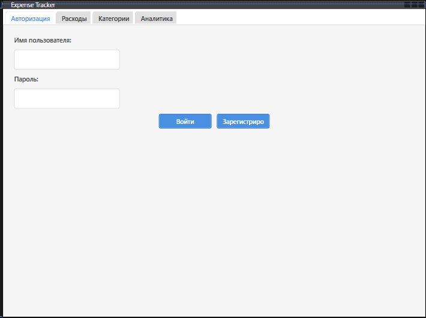

# Инструкция пользователя — ExpenseTrackerApp

---

## Вход в систему

При запуске приложения откроется окно авторизации.

**Введите:**

- **Логин** — ваша учетная запись  
- **Пароль** — ваш персональный пароль

После успешного входа откроется главное окно приложения со вкладками.

---

## Главное окно

Приложение состоит из следующих вкладок:

- **Категории расходов**
- **Расходы**

---

## Работа с расходами

### Просмотр

Во вкладке **"Расходы"** отображается список всех внесённых трат. Таблица включает:

- Дата
- Категория
- Сумма
- Комментарий

---

### Добавление расхода

1. Нажмите кнопку **"Добавить"**
2. Заполните поля:
   - **Дата**
   - **Категория**
   - **Сумма**
   - **Комментарий** (необязательно)
1. Нажмите **"Сохранить"**

---

### Редактирование / Удаление

- Выделите нужную строку в таблице
- Нажмите **"Редактировать"** или **"Удалить"**
- При редактировании откроется форма с текущими данными расхода

---

## Работа с категориями

### Просмотр

Во вкладке **"Категории"** отображаются все доступные типы расходов  
(например: Продукты, Транспорт, Связь и т.д.)

---

### Добавление категории

1. Нажмите **"Добавить категорию"**
2. Введите название (например: `Кафе`, `Топливо`, `Аренда`)
3. Нажмите **"Сохранить"**

---

### Редактирование / Удаление

- Выделите категорию в списке
- Нажмите **"Редактировать"** или **"Удалить"**

---

## Фильтрация расходов

Вверху вкладки **"Расходы"** доступны фильтры:

- По **дате** (от / до)
- По **категории**
- По **сумме**

Нажмите **"Применить фильтр"**, чтобы отобразить нужные данные.

---

## Типовые проблемы и решения

| Проблема                     | Решение                                      |
|-----------------------------|-----------------------------------------------|
| Не удается войти            | Проверьте логин и пароль, раскладку клавиатуры |
| Не добавляется запись       | Убедитесь, что все обязательные поля заполнены |
| Категория не отображается   | Обновите данные или перезапустите приложение  |
| Сумма отображается некорректно | Проверьте формат чисел и региональные настройки |

---

## Контакты поддержки

Если у вас возникли проблемы с приложением, обратитесь к Разработчику приложения
