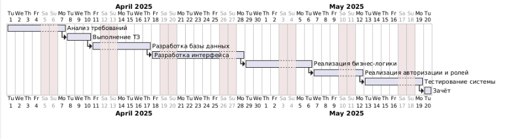

| Этап | Описание этапа                          | Инструменты / Технологии             | Статус     |
| ---- | --------------------------------------- | ------------------------------------ | ---------- |
| 1    | Анализ требований и постановка задачи   | MS Word, обсуждение с преподавателем | Завершено  |
| 2    | Проектирование структуры базы данных    | SQL Server, диаграмма БД             | Завершено  |
| 3    | Создание проекта WPF                    | Visual Studio, .NET Framework        | Завершено  |
| 4    | Создание EDM-модели (Entity Data Model) | ADO.NET EDM, SQL Server              | Завершено  |
| 5    | Разработка вкладки                      | WPF, XAML, C#                        | Завершено  |
| 6    | Реализация регистрации                  | WPF, Entity Framework                | Завершено  |
| 7    | Реализация фильтрации                   | LINQ                                 | Завершено  |
| 8    | Валидация данных в UI                   | C#, TryParse, проверки TextBox       | Завершено  |
| 9    | Тестирование проекта                    | Ручное тестирование                  | Завершено  |
| 10   | Написание документации                  | Obsidian                             | В процессе |

### Используемые технологии

- **Язык программирования**: C#
    
- **Графический интерфейс**: WPF (XAML)
    
- **База данных**: Microsoft SQL Server
    
- **Доступ к БД**: ADO.NET Entity Data Model (EDM)
    
- **Запросы к данным**: LINQ
    
- **Среда разработки**: Visual Studio
  
  